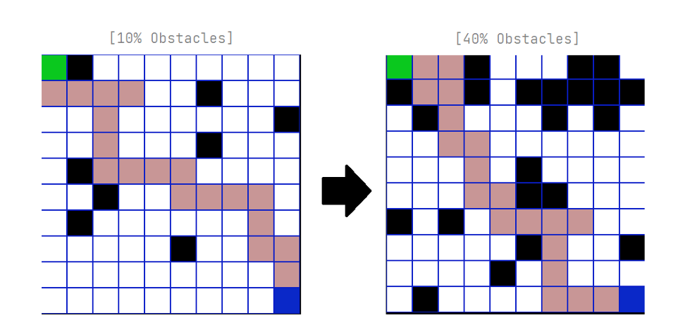

# Generic Algorithm Pathfinder

Implementation of a simplistic generic algorithm pathfinder, written in Python. Made 
in relation to an AI class at university, in an attempt to understand the most 
effective pathfinding algorithms in video games. 

This generic algorithm was tested and compared against the tried and true A-star  
pathfinding algorithm. 

Submitted as an assignment project at Bournemouth University (2022). 
You can find out more by reading the assignment report - [here.](https://drive.google.com/file/d/18mccUWHZIHPa_FKNglcwGkAoh1zM3zqx/view?usp=sharing) 
You can try the pathfinder out yourself by downloading the source code - [here.](https://drive.google.com/file/d/1ZAmrKnnLbqe7F2Vg1eYROOIdvBelC2AH/view?usp=drive_link) 

  

